```mermaid
graph TD
    A[User opens app for first time] --> B{Landing Screen};
    B -- Taps 'Sign Up' --> C[Signup Form];
    B -- Taps 'See How It Works' --> D[3-Screen Demo];
    D --> C;

    C -- Enters credentials --> E{Account Creation};
    E -- Success --> F[Guided Pantry Setup Screen];
    E -- Failure (email exists) --> G[Error: Email exists];
    G --> C;

    subgraph Pantry Setup
        F --> H{User taps 'Quick Add' items};
        H --> I[Items get '✓' checkmark];
        I --> J[Counter updates: 'Added: X items'];
        J --> K{User taps 'Continue'};
    end

    F -- Taps 'Skip for Now' --> L[Empty State Recipe Screen];

    K --> M[Loading: 'Finding recipes...'];
    M --> N[✨ 'You Can Make These!' Screen];
    N --> O[🟢 'Ready to Cook' section is expanded];
    O --> P[User sees first recipe matches];

    P --> Q{User taps a recipe};
    Q --> R[Recipe Detail View];
    R --> S[Onboarding Complete: User is activated];
```

# {{project_name}} UX Design Specification

_Created on {{date}} by {{user_name}}_
_Generated using BMad Method - Create UX Design Workflow v1.0_

---

## Executive Summary

A mobile-responsive web application that helps users reduce food waste and discover meal inspiration by intelligently managing their kitchen inventory. The long-term vision is to evolve into a comprehensive kitchen assistant that not only reduces food waste but also helps users make healthier and more sustainable food choices.

---

## 1. Design System Foundation

### 1.1 Design System Choice

**Chosen Design System:** shadcn/ui

**Rationale:**
- **Timeline Alignment:** The 6-week MVP timeline necessitates using production-ready components, which shadcn/ui provides, avoiding the need to build basic UI elements from scratch. The copy-paste approach ensures full code control.
- **Accessibility:** WCAG 2.1 AA compliance is a project goal, and shadcn/ui, built on Radix UI primitives, offers battle-tested accessibility features including keyboard navigation, ARIA labels, and focus management.
- **Mobile-First:** Components are responsive out-of-the-box and touch-friendly, integrating seamlessly with Tailwind CSS for mobile-first breakpoints.
- **Emotional Target:** The clean, professional, and trustworthy design aesthetic of shadcn/ui directly supports the "Resourceful + Relief" emotional target, allowing users to focus on core functionality rather than UI flourishes.
- **Technical Alignment:** shadcn/ui is already listed in the project's technical framework, and its excellent TypeScript support and synergy with Tailwind CSS make it a natural fit for the team's skills.

---

## 2. Core User Experience

### 2.1 Defining Experience

The defining experience of the application is best captured by the phrase: **"It's the app that looks at your pantry and says 'you can make this'."**

This is not a simple recipe search, but a discovery engine that starts with what the user already has and shows them what is possible.

**The Core Interaction Loop:**
1.  The user opens the app and sees their current inventory.
2.  The app instantly presents recipe matches based on that inventory.
3.  Crucially, the app includes suggestions where the user is only missing one or two ingredients.

**The Moment of Delight (The "Magic"):**
The key differentiator and the core of the user experience is the contextual presentation of recipes:
-   **Perfect Match:** "🟢 **Chicken Stir Fry** - You have everything!"
-   **Near Match:** "🟡 **Pad Thai** - You need: fish sauce, lime"

This "near match" feature is what makes the app unique. Instead of hiding recipes the user can't make, it empowers them by showing how close they are, transforming a "no" into an actionable "almost." This directly supports the emotional goal of making the user feel resourceful and relieved.

**The Defining Screen:**
The recipe discovery view is the epicenter of this experience. It must clearly display:
-   Recipes scored or categorized by match quality (e.g., perfect match, near match).
-   A clear and concise list of any missing ingredients for "near match" recipes.
-   Contextual calls-to-action that change based on the match quality (e.g., "Cook This" vs. "Add 2 Items & Cook").

This interaction—the intelligent, contextual matching of inventory to recipes—is the app's "swipe to match" moment and the foundation of its competitive moat.

### 2.2 Novel UX Patterns

The core differentiator of the app is the **"Smart Recipe Match"** interaction. This pattern is designed to be the defining "magic moment" for the user, transforming the anxiety of meal planning into a feeling of resourceful discovery.

**Pattern Name:** Smart Recipe Match

**User Goal:** To quickly understand what meals can be made with current inventory, see the effort required for each, and feel a sense of possibility rather than scarcity.

**Trigger:**
-   **Primary:** Automatic on app open for logged-in users. The home screen *is* the recipe match screen.
-   **Secondary:** A dedicated "What Can I Cook?" navigation item, a pull-to-refresh gesture, and automatic refresh after pantry updates.

**Interaction Flow & Visual Feedback:**
1.  **Categorization:** On load, recipes are automatically categorized into three collapsible sections, color-coded for immediate visual scanning:
    -   **🟢 Ready to Cook:** Perfect matches. Collapsed by default to prioritize actionable opportunities.
    -   **🟡 Almost There:** Missing 1-2 ingredients. Expanded by default as this is the core "magic" of the app.
    -   **⚪ Need More:** Missing 3+ ingredients. Collapsed by default.
2.  **Recipe Cards:** Each recipe is displayed on a card with key information glanceable:
    -   Recipe name, image, cooking time, and servings.
    -   A prominent color-coded badge (🟢, 🟡, ⚪) indicating match status.
    -   For 🟡 cards, a summary of missing items (e.g., "Missing: fish sauce, lime (2)").
    -   Contextual buttons (e.g., "Cook This" vs. "Add to List").
3.  **Progressive Disclosure:** Tapping a card expands it or opens a bottom sheet on mobile, showing a full ingredient list with visual checkmarks (✅ for owned, ❌ for missing) to provide detail without cluttering the main view.

**States:**
-   **Loading:** A skeleton screen with shimmering placeholders and a message like "🔍 Finding your perfect matches..." to manage perceived latency.
-   **Ideal State:** The three-tiered list of recipes, populated and interactive.
-   **Empty State (Zero Matches):** A "catastrophic failure" is avoided by always showing fallback tiers (e.g., popular recipes). If the pantry is truly empty, the UI reframes it as an opportunity: "🍳 Let's get you started! Add a few ingredients to see recipe suggestions."
-   **Error State (API Down):** The app enters a "⚠️ Limited mode," clearly communicating the issue and serving recipes from an offline cache. A "Retry" button is provided.

**Platform Considerations:**
-   **Mobile (Primary):**
    -   Layout is a single vertical list with collapsible sections.
    -   Swipe gestures on cards for quick actions (e.g., swipe right to "Add to List").
    -   A persistent Floating Action Button (FAB) for "Add Food."
    -   Recipe details appear in a bottom sheet that can be swiped up.
    -   Subtle haptic feedback for key actions like "recipe unlocked."
-   **Desktop:**
    -   Layout is a multi-column grid to better utilize space.
    -   Hover states reveal details like the full ingredient checklist.
    -   Keyboard shortcuts for navigation (`/` to search, `↑↓` to navigate, `Enter` to select).
    -   A persistent sidebar for navigation.

**Accessibility:**
-   Color-coding (🟢, 🟡, ⚪) will be paired with icons and text labels to ensure it's not the only means of conveying information.
-   All interactive elements will be keyboard-navigable and have clear focus states.
-   ARIA labels will be used to describe the status of recipes and components to screen readers.

**Inspiration:**
-   **Spotify's "Made For You":** Using visual cues (like ingredient icons) to build confidence in recommendations.
-   **Duolingo's Lesson Screen:** A visual hierarchy of readiness (completed, current, locked) that maps directly to the 🟢🟡⚪ system.
-   **Google Maps' Route Options:** Presenting choices with clear trade-offs (e.g., "Ready Now" vs. "Quick Shop Trip").
-   **Notion's "/" Command:** Using smart autocomplete for friction-free data entry when adding items to a shopping list.

### 2.3 Core Experience Principles

Based on the defining experience and the "Smart Recipe Match" pattern, the following principles will guide all UX design decisions:

**Speed: Instantaneous and Responsive**
-   The app must feel instantaneous, especially for the core recipe discovery flow. Perceived speed will be prioritized over raw technical speed through the use of optimistic UI (loading cached data first), background pre-fetching, and skeleton screens with micro-animations to mask latency.

**Guidance: Proactive and Empowering**
-   The app will proactively guide users toward feeling resourceful, turning potential dead ends (like zero search results) into actionable opportunities. This will be achieved through the 🟢🟡⚪ matching system, helpful empty states that suggest next steps, and contextual suggestions that feel anticipatory.

**Flexibility: Forgiving and In Control**
-   The app will provide users with choices and control, allowing them to recover from mistakes and adapt the app to their needs. This is exemplified by features like the "Undo Ingredient Use" option, clear confirmation dialogs before destructive actions, and the choice to see "Almost There" recipes instead of having them hidden.

**Feedback: Clear and Delightful**
-   Feedback will be immediate, clear, and often delightful, reinforcing the user's sense of accomplishment and progress. This will be delivered through purposeful micro-interactions (e.g., the "recipe unlocked" animation), celebratory messages ("You saved 2 items from waste!"), and transparent status indicators (e.g., "Last synced:", "Limited mode").

---

## 3. Visual Foundation

### 3.1 Color System

The chosen color theme is **Theme 1: Fresh & Focused**. This theme leverages a calming, natural green as its primary color, aligning with the project's emphasis on fresh ingredients, health, and sustainability. It evokes a sense of organization and feels at home in a kitchen environment, directly supporting the "Resourceful + Relief" emotional target.

**Color Palette (Fresh & Focused):**
-   **Primary:** `#22c55e` (Green) - Used for primary actions, key interactive elements, and positive affirmations.
-   **Primary-Foreground:** `#ffffff` (White) - Text color for elements on primary backgrounds.
-   **Secondary:** `#f0fdf4` (Light Green) - Used for secondary backgrounds, subtle accents, and muted elements.
-   **Secondary-Foreground:** `#166534` (Dark Green) - Text color for elements on secondary backgrounds.
-   **Destructive:** `#ef4444` (Red) - Used for critical actions (e.g., delete) and error states.
-   **Destructive-Foreground:** `#fafafa` (White) - Text color for elements on destructive backgrounds.
-   **Status - Ready (🟢):** `#22c55e` (Green) - Integrated primary green for "Ready to Cook" status.
-   **Status - Almost (🟡):** `#f59e0b` (Orange/Amber) - A warm, inviting amber for "Almost There" status, indicating opportunity.
-   **Status - Need More (⚪):** `#e5e7eb` (Light Gray) - A neutral, subtle gray for "Need More" status.
-   **Background:** `#ffffff` (White) - Clean, generous white space for clarity.
-   **Foreground:** `#111827` (Dark Gray) - Primary text color for readability.
-   **Border:** `#e5e7eb` (Light Gray) - Subtle borders for structure.
-   **Input:** `#e5e7eb` (Light Gray) - Input field borders.
-   **Ring:** `#4ade80` (Accent Green) - Focus ring color.

**Interactive Visualizations:**

- Color Theme Explorer: [ux-color-themes.html](./ux-color-themes.html)

### 3.2 Typography System

The typography system is designed for clarity, readability, and an approachable yet professional feel, complementing the "Fresh & Focused" color palette. It leverages system fonts for performance and broad compatibility, with a clear hierarchy.

-   **Font Families:**
    -   **Headings:** `Inter`, `ui-sans-serif`, `system-ui`, `-apple-system`, `BlinkMacSystemFont`, `"Segoe UI"`, `Roboto`, `"Helvetica Neue"`, `Arial`, `"Noto Sans"`, `sans-serif`, `"Apple Color Emoji"`, `"Segoe UI Emoji"`, `"Segoe UI Symbol"`, `"Noto Color Emoji"`
    -   **Body Text:** `Inter`, `ui-sans-serif`, `system-ui`, `-apple-system`, `BlinkMacSystemFont`, `"Segoe UI"`, `Roboto`, `"Helvetica Neue"`, `Arial`, `"Noto Sans"`, `sans-serif`, `"Apple Color Emoji"`, `"Segoe UI Emoji"`, `"Segoe UI Symbol"`, `"Noto Color Emoji"`
    -   **Monospace:** `ui-monospace`, `SFMono-Regular`, `Menlo`, `Monaco`, `Consolas`, `"Liberation Mono"`, `"Courier New"`, `monospace`
-   **Type Scale:**
    -   `h1`: 2.25rem (36px)
    -   `h2`: 1.875rem (30px)
    -   `h3`: 1.5rem (24px)
    -   `h4`: 1.25rem (20px)
    -   `h5`: 1.125rem (18px)
    -   `h6`: 1rem (16px)
    -   `body`: 1rem (16px)
    -   `small`: 0.875rem (14px)
    -   `tiny`: 0.75rem (12px)
-   **Font Weights:** Regular (400), Medium (500), Semibold (600) for clear visual hierarchy.
-   **Line Heights:** Optimized for readability across all text sizes.

### 3.3 Spacing and Layout Foundation

A consistent spacing and layout system will ensure visual harmony, responsiveness, and ease of development using Tailwind CSS.

-   **Base Unit:** 4px. All spacing values will be multiples of 4px for a predictable rhythm.
-   **Spacing Scale:**
    -   `xs`: 4px
    -   `sm`: 8px
    -   `md`: 16px
    -   `lg`: 24px
    -   `xl`: 32px
    -   `2xl`: 48px
    -   ... (extending as needed for larger gaps)
-   **Layout Grid:** A standard 12-column grid system, facilitated by Tailwind CSS, will be used for flexible and responsive content arrangement.
-   **Container Widths:**
    -   `sm`: max-width: 640px
    -   `md`: max-width: 768px
    -   `lg`: max-width: 1024px
    -   `xl`: max-width: 1280px
    -   `2xl`: max-width: 1536px
    These breakpoints will ensure optimal content presentation across various screen sizes, from mobile to large desktops.

---

## 4. Design Direction

### 4.1 Chosen Design Approach

The chosen design direction is **Direction 3: Pantry Management (Clean & Card-Focused)**. This approach applies a clean, card-focused aesthetic to the Pantry Management screen, emphasizing clear item cards, easy-to-read expiration dates, and prominent actions. This direction aligns well with the "Resourceful + Relief" emotional target by providing a clear, scannable, and actionable overview of the user's inventory.

**Key Characteristics of Chosen Direction:**
-   **Screen Focus:** Pantry Management
-   **Layout:** Card-based, vertical stack for mobile, adaptable to grid for desktop.
-   **Visual Density:** Balanced, with generous white space around cards.
-   **Navigation:** Clear top navigation (as established in UX overview).
-   **Primary Action Prominence:** Prominent "Add Food" Floating Action Button (FAB) on mobile, clear "Edit" and "Use" actions on each card.
-   **Visual Style:** Clean, modern, utilizing the "Fresh & Focused" color theme.

**Interactive Mockups:**

- Design Direction Showcase: [ux-design-directions.html](./ux-design-directions.html)

**Design Directions Explored:**

1.  **Clean & Card-Focused (Smart Recipe Match):** A balanced approach with clear card boundaries, prominent recipe images, and collapsible sections for match status. Focuses on scannability and intuitive interaction.
2.  **Compact & List-Driven (Smart Recipe Match):** A more minimalist approach, prioritizing information density with a list view. Less emphasis on large images, more on quick scanning of text and status.
3.  **Pantry Management (Clean & Card-Focused):** Applies the "Clean & Card-Focused" aesthetic to the Pantry screen, featuring clear item cards, easy-to-read expiration dates, and prominent actions.
4.  **Recipe Detail View (Clean & Card-Focused):** A clean, focused view for individual recipes, emphasizing readability of instructions and clear indication of ingredient availability.
5.  **Visual & Immersive (Smart Recipe Match):** Emphasizes large, appealing recipe imagery with a more dynamic layout. Aims for a magazine-like feel to inspire and delight, while still clearly communicating match status.
6.  **Pantry Management (Compact & List-Driven):** A high-density list view for pantry items, allowing users to quickly scan many items. Actions are accessible but less visually dominant.

*Awaiting user feedback to finalize the preferred design direction(s).*

---

#### User Journey: Adding Groceries to the Pantry

**User Goal:** A user comes home from shopping and quickly adds new grocery items to their pantry, including name, quantity, and expiration date, with minimal friction.

**Approach:** Smart Hybrid (Option C) - A single, dynamic screen that starts with the most important input (Name) and uses smart defaults for everything else, allowing for quick additions and flexible overrides.

**Flow Steps:**

1.  **Entry Point:**
    -   **User sees:** A Floating Action Button (FAB) with a "+" icon, always visible at the bottom-right of the screen.
    -   **User does:** Taps the FAB.
    -   **System responds:** Opens a modal/bottom sheet titled "Add to Pantry" with a search input and "Quick Add" shortcuts (e.g., Eggs, Milk, Bread).

2.  **Ingredient Input:**
    -   **User sees:** Search input field ("Search ingredient...") and Quick Add buttons.
    -   **User does:**
        -   (Common Item) Taps a "Quick Add" button (e.g., "🥚 Eggs").
        -   (Uncommon Item) Types in the search input (e.g., "chicken").
    -   **System responds:**
        -   (Quick Add) Pre-fills the item name and smart defaults (quantity, unit, expiration).
        -   (Search) Displays instant autocomplete suggestions from Spoonacular API. If no match, shows "Can't find it? Add custom item."

3.  **Item Details & Confirmation:**
    -   **User sees:** Selected item name (e.g., "Chicken breast, boneless") with pre-filled smart defaults for Quantity (e.g., "500g"), Unit (e.g., "g"), and Expiration Date (e.g., "Nov 18"). Editable fields are present.
    -   **User does:**
        -   (Quick Add/Defaults Fine) Taps "Add to Pantry" button.
        -   (Adjust Details) Taps on Quantity, Unit, or Expiration to adjust, then taps "Add to Pantry".
    -   **System responds:**
        -   Displays "✓ Added [item name]" toast notification.
        -   Shows options: "[Add another item]" and "[Done]".
        -   Updates a running count (e.g., "3 items added today").

4.  **Bulk Entry / Completion:**
    -   **User sees:** "✓ Added [item name]" toast, "[Add another item]", "[Done]" buttons.
    -   **User does:**
        -   (Bulk Entry) Taps "[Add another item]" to repeat step 2.
        -   (Completion) Taps "[Done]".
    -   **System responds:**
        -   (Add another) Clears the input, ready for the next item.
        -   (Done) Closes the modal/bottom sheet and returns to the previous screen (e.g., Pantry view).

**Decision Points:**

-   **Item Already Exists:** If a user adds an item they already have, the system prompts: "You already have [item] ([quantity]). Replace with new expiration date, Add more (increase quantity), or Cancel?"
-   **Custom Item:** If Spoonacular search yields no results, a "Add custom item" button appears, allowing manual entry but with a warning that it won't auto-match recipes.

**Error States & Recovery:**

-   **Typo in Quantity/Expiration:** User can navigate to the Pantry, tap the item, and edit inline. An "Undo" button is available for 5 seconds after adding.
-   **Accidental Tap on Quick Add:** A confirmation dialog appears (e.g., "Add Eggs (12 pieces) to pantry?") allowing the user to cancel or adjust before confirming.

**Success State:**

-   **Immediate:** "✓ Added [item name]" toast, running count update.
-   **Visual:** Newly added items in the Pantry view have a subtle highlight/glow that fades.
-   **Emotional:** A "magic moment" banner appears (e.g., "🎉 Great! You can now make 12 recipes! [See What You Can Cook]") connecting data entry to immediate value.

**Mermaid Diagram:**

```mermaid
graph TD
    A[User opens app] --> B{FAB '+' tapped};
    B --> C[Add to Pantry modal/sheet opens];
    C --> D{User input: Quick Add or Search};

    D -- Quick Add --> E[Item name & smart defaults pre-filled];
    D -- Search --> F[Autocomplete suggestions];
    F -- Select suggestion --> E;
    F -- No match --> G[Add custom item option];
    G --> H[Manual input for custom item];
    H --> I[Custom item added];

    E --> J{User reviews/edits details};
    J -- Defaults fine / Edits complete --> K[Taps 'Add to Pantry'];

    K --> L[Toast: '✓ Added [item]'];
    L --> M{Options: 'Add another item' / 'Done'};

    M -- Add another item --> C;
    M -- Done --> N[Return to Pantry/Previous Screen];

    N --> O[Pantry view updated with new item];
    O --> P[Magic Moment: '🎉 You can now make X recipes!'];

    subgraph Error Handling
        Q[Item already exists] --> R{Prompt: Replace/Add more/Cancel};
        S[Spoonacular no match] --> G;
        T[Accidental Quick Add] --> U{Confirmation dialog};
    end
```

#### User Journey: Finding a Recipe for Dinner

**User Goal:** A hungry user quickly discovers recipes they can make with their current inventory, including options that require minimal additional ingredients, and proceeds to cook a chosen meal.

**Approach:** Accordion/Collapsible List (Option C) - The home screen presents recipe matches in collapsible, color-coded sections, prioritizing immediate value while showing other possibilities.

**Flow Steps:**

1.  **Entry Point (App Open):**
    -   **User sees:** The "What Can You Cook?" screen immediately (<1 second load time).
        -   **🟢 Ready to Cook** section (e.g., "Ready to Cook (3)") is auto-expanded, showing recipe cards.
        -   **🟡 Almost There** (e.g., "Almost There (5)") and **⚪ Need More** (e.g., "Need More (12)") sections are collapsed, showing only their titles and recipe counts.
    -   **User does:** Scans the "Ready to Cook" recipes or taps to expand "Almost There" or "Need More" sections.
    -   **System responds:** Displays recipe cards with images, names, cooking times, servings, and match status (🟢, 🟡, ⚪). For 🟡 recipes, it shows "Missing: [items] ([count])".

2.  **Recipe Selection & Detail View:**
    -   **User sees:** Recipe cards in the list.
    -   **User does:** Taps a recipe card (e.g., "Pad Thai" from "Almost There").
    -   **System responds:** Opens a recipe detail view (e.g., a bottom sheet on mobile) for the selected recipe.
        -   Displays recipe image, name, meta-info (time, servings).
        -   Shows an ingredient list with clear indicators: ✓ for owned, ❌ for missing.
        -   Presents contextual action buttons: "Add Missing to List" (for 🟡 recipes), "Cook This" (for 🟢 recipes), "Cook This Anyway" (for 🟡 recipes if user wants to proceed without missing items).
        -   Instructions are progressively disclosed (e.g., visible on scroll or after tapping "Cook This").

3.  **Action on Recipe:**
    -   **User sees:** Recipe detail view with action buttons.
    -   **User does:**
        -   (For 🟢 recipe) Taps "Cook This".
        -   (For 🟡 recipe) Taps "Add Missing to List".
        -   (For 🟡 recipe) Taps "Cook This Anyway".
    -   **System responds:**
        -   **"Cook This" / "Cook This Anyway":** Presents a confirmation dialog: "Ready to cook [Recipe Name]? This will use from your pantry: [list of ingredients with quantities]." Offers "[Cancel]" and "[Yes, Let's Cook]" buttons.
        -   **"Add Missing to List":** Adds missing ingredients to the grocery list. Displays a toast: "✓ Added to shopping list." Recipe is saved to "Planned Meals."

4.  **Confirmation & Cooking:**
    -   **User sees:** Confirmation dialog.
    -   **User does:** Taps "[Yes, Let's Cook]".
    -   **System responds:**
        -   Displays a success toast: "✓ Enjoy your meal! 🍽️".
        -   Automatically navigates to the recipe instructions view.
        -   Deducts ingredients from the pantry in the background.
        -   Moves the recipe to a "Recently Cooked" section.
        -   Triggers a "🌱 You saved X items from waste!" notification if applicable.

**Decision Points:**

-   **Initial Recipe List Expansion:** If 5+ 🟢 recipes, expand 🟢. If 0-2 🟢 recipes but 3+ 🟡 recipes, expand 🟡. If all are ⚪, show a helpful empty state with "Browse All Recipes" fallback.
-   **Missing Ingredients Action:** User can choose to "Add Missing to List" (for shopping) or "Cook This Anyway" (if they plan to substitute or omit).
-   **Accidental "Cook This"**: A confirmation dialog prevents accidental deductions. A time-limited "Undo" option (e.g., 10-15 minutes) is available in the Pantry for post-confirmation mistakes.

**Error Recovery:**

-   **Zero Results:** If the pantry is empty/minimal, a helpful empty state guides the user to "Add Ingredients" or "Browse All Recipes" (from Spoonacular).
-   **API Down:** The app enters "Limited Mode," serving cached recipes and clearly communicating the status.
-   **Wrong Recipe Confirmed:** A time-limited "Undo Ingredient Use" option is available in the Pantry.

**Mermaid Diagram:**

```mermaid
graph TD
    A[User opens app] --> B{Recipe Match Screen};

    subgraph Recipe Match Screen
        B -- Auto-expanded --> C[🟢 Ready to Cook (X) section];
        B -- Collapsed --> D[🟡 Almost There (Y) section];
        B -- Collapsed --> E[⚪ Need More (Z) section];
    end

    C --> F{User taps 🟢 recipe card};
    D --> G{User taps 🟡 recipe card};
    E --> H{User taps ⚪ recipe card};

    F -- View Details --> I[Recipe Detail View (🟢)];
    G -- View Details --> J[Recipe Detail View (🟡)];
    H -- View Details --> K[Recipe Detail View (⚪)];

    I -- Taps 'Cook This' --> L[Confirmation Dialog];
    J -- Taps 'Add Missing to List' --> M[Add to Grocery List];
    J -- Taps 'Cook This Anyway' --> L;
    K -- Taps 'View Recipe' --> J;

    L -- 'Yes, Let's Cook' --> N[Success Toast: 'Enjoy your meal!'];
    L -- 'Cancel' --> J;

    N --> O[Navigate to Instructions View];
    N --> P[Deduct ingredients from Pantry];
    N --> Q[Move recipe to 'Recently Cooked'];
    N --> R[Trigger 'Waste Saved' notification];

    M --> S[Toast: 'Added to shopping list'];
    M --> T[Recipe saved to 'Planned Meals'];

    subgraph Error Handling
        U[No recipes found] --> V[Helpful Empty State];
        W[API Down] --> X[Limited Mode (cached recipes)];
        Y[Accidental 'Cook This'] --> L;
        Z[Confirmed wrong recipe] --> AA[Time-limited 'Undo' in Pantry];
    end
```

#### User Journey: Checking Pantry While at the Store

**User Goal:** A user in a grocery store, with potentially poor connectivity, quickly checks their pantry to avoid buying duplicates.

**Approach:** Categorized Accordion (Option C) - The pantry is organized into collapsible categories, loading instantly from a local cache, with a prominent sync status to build trust.

**Flow Steps:**

1.  **Entry Point (App Open):**
    -   **User sees:** The "My Pantry" screen loads instantly (<100ms) from the local cache.
        -   A prominent, color-coded sync status is at the top (e.g., "⚠️ Last synced: 2 hours ago" or "📵 Offline - showing cached data").
        -   A quick search bar is visible.
        -   Items are grouped into collapsible categories (e.g., "Dairy & Eggs (4)", "Proteins (3)").
    -   **User does:** Scans the categories or taps the search bar.
    -   **System responds:** The UI is immediately interactive. If online, a background sync is attempted without blocking the UI.

2.  **Finding an Item:**
    -   **User sees:** The list of collapsed categories.
    -   **User does:**
        -   (Browse) Taps a category (e.g., "Dairy & Eggs") to expand it.
        -   (Search) Taps the search bar and types an item name (e.g., "milk").
    -   **System responds:**
        -   (Browse) The category expands with a smooth animation, showing the items within, sorted alphabetically. Expiration dates are clearly visible.
        -   (Search) The list filters in real-time to show matching items from the cache.

3.  **Confirmation & Decision:**
    -   **User sees:** The item they were looking for (e.g., "• Milk - 1L 📅 Nov 15").
    -   **User does:** Mentally confirms they have the item.
    -   **System responds:** No system action is needed. The UI has served its purpose by providing the information.

4.  **Success:**
    -   **User sees:** The information they needed.
    -   **User does:** Makes a confident shopping decision (e.g., "I don't need to buy milk"). Puts their phone away.
    -   **System responds:** The app has successfully prevented a duplicate purchase and reinforced its reliability.

**Decision Points:**

-   **Data Freshness:** The user can tap the sync status to manually trigger a sync attempt if they are online and want the absolute latest data.
-   **Item Not Found:** If a search yields no results, the app presents an actionable message: "Not in your pantry. [Add to Shopping List?]"
-   **Sync Conflict (Edge Case):** If a background sync detects a conflict (e.g., item was used on another device), the UI will prompt the user to resolve it: "Conflict for 'Eggs'. Keep your change or use the server's version?"

**Error Recovery:**

-   **No Connectivity:** The app functions perfectly using cached data. The "Offline" status is clearly communicated.
-   **Stale Data:** The prominent timestamp ("Last synced: 6 hours ago") manages user expectations. The data is still presented as the best available information.
-   **Accidental Deletion:** If a user tries to manage items in the store, any deletion action requires a confirmation dialog ("Delete Milk?"), followed by a 10-second "Undo" toast.

**Mermaid Diagram:**

```mermaid
graph TD
    A[User opens app in store] --> B{Pantry screen loads instantly from cache};
    B --> C[Show prominent Sync Status (e.g., '⚠️ Last synced: 2h ago')];
    B --> D[Display collapsible categories (e.g., 'Dairy', 'Proteins')];
    B --> E[Display Quick Search bar];

    subgraph User Interaction
        D -- Taps category --> F[Category expands to show items];
        E -- Types in search --> G[List filters to show matching items];
    end

    F --> H{User visually finds item};
    G --> H;

    H --> I[User makes shopping decision];
    I --> J[Puts phone away];

    subgraph Background & Edge Cases
        K[Connectivity check] -- Online --> L[Attempt background sync];
        K -- Offline --> M[Show '📵 Offline' status];
        L -- Sync success --> N[Update timestamp: '✓ Synced just now'];
        L -- Sync fail --> O[Update timestamp: 'Can't sync'];
        P[Search finds no results] --> Q[Prompt: 'Add to Shopping List?'];
    end
```

#### User Journey: Getting Dinner Inspiration at the Store

**User Goal:** A user in a grocery store browses recipes to decide what to make for dinner, leveraging their current pantry to minimize purchases.

**Approach:** Automatic Context-Aware Mode (Option C) - The app detects (or is manually switched to) "Shopping Mode," which prioritizes recipes that are "Almost There" (missing 1-2 ingredients).

**Flow Steps:**

1.  **Entry Point (App Open in Store):**
    -   **User sees:** The app loads into "🛒 Shopping Mode." The recipe list is immediately visible, with the **🟡 You're Close!** section auto-expanded.
    -   **User does:** Scans the list of recipes that require only a few items.
    -   **System responds:** Recipe cards are simplified for the shopping context, highlighting the number of missing items (e.g., "Need 2: fish sauce, lime").

2.  **Recipe Selection & Shopping List Creation:**
    -   **User sees:** A list of inspiring, achievable recipes.
    -   **User does:** Taps a recipe card (e.g., "Pad Thai").
    -   **System responds:** Opens a recipe detail view where the "Shopping List" (missing items) is prioritized at the top, followed by the "You Already Have" section.
    -   **User does:** Taps the "[Add to Shopping List]" button.
    -   **System responds:** Displays a toast "✓ Added to Shopping List" and updates a persistent shopping list icon in the header with a badge (e.g., "📋 2 items").

3.  **Shopping & In-Store Interaction:**
    -   **User sees:** The persistent shopping list icon.
    -   **User does:** Taps the icon to view their consolidated shopping list, grouped by recipe. As they find items in the store, they tap the checkbox next to each item.
    -   **System responds:** The checked-off item is visually marked as complete (e.g., strikethrough).

4.  **Success (Post-Shopping):**
    -   **User sees:** A completed shopping list ("✓ All items found!").
    -   **User does:** Taps "[Mark as Purchased]".
    -   **System responds:**
        -   Displays a success message: "🎉 Items added to pantry! Pad Thai is now ready to cook!".
        -   Automatically adds the purchased items to the user's pantry.
        -   Updates the recipe's status from 🟡 to 🟢. The next time the user opens the app at home, the recipe will appear in the "Ready to Cook" section.

**Decision Points:**

-   **Shopping Mode Activation:** The app will attempt to auto-detect a grocery store location (with permission) to activate Shopping Mode, but will always provide a manual toggle for user control.
-   **Multiple Recipes:** If the user adds items from multiple recipes, the shopping list will intelligently consolidate ingredients (e.g., "Fish Sauce (3 tbsp total)").
-   **Item Not Found in Store:** The user can tap "Can't find it?" on a shopping list item to see potential substitutes (a Phase 2 AI feature) or to simply skip the item.

**Error Recovery:**

-   **Accidental Add to List:** A 10-second "Undo" banner appears after adding a recipe's ingredients to the list. The user can also remove all items for a specific recipe from the shopping list view.
-   **Forgot to Mark as Purchased:** If the user opens the app the next day with items still on their list, a smart prompt will ask, "Did you buy the 2 items from yesterday? [Yes, Add to Pantry]".

**Mermaid Diagram:**

```mermaid
graph TD
    A[User opens app in store] --> B{App enters '🛒 Shopping Mode'};
    B --> C[🟡 'You're Close' recipes shown first];
    C --> D{User taps a recipe card};
    D --> E[Recipe Detail View];
    E --> F[Missing items ('Shopping List') shown at top];
    F --> G{User taps 'Add to Shopping List'};
    G --> H[Toast: '✓ Added to list'];
    H --> I[Shopping list icon updates with badge (e.g., '📋 2')];

    subgraph Shopping
        I --> J{User taps shopping list icon};
        J --> K[Consolidated Shopping List View];
        K -- User finds items --> L[User checks off items on list];
        L -- All items found --> M{User taps 'Mark as Purchased'};
    end

    M --> N[Success: '🎉 Items added to pantry!'];
    N --> O[Purchased items added to Pantry data];
    N --> P[Recipe status updated from 🟡 to 🟢];

    subgraph Edge Cases
        Q[Auto-detection of store] --> B;
        R[Manual toggle] --> B;
        S[User adds multiple recipes] --> T[Shopping list consolidates ingredients];
    end
```

#### User Journey: Using Expiring Food

**User Goal:** A user is proactively notified about items nearing their expiration date and is guided to recipes that use those items, preventing food waste.

**Approach:** Integrated Banner (Option A) - A proactive, contextual banner on the home screen serves as the primary, opportunity-focused entry point to the "Use It Up!" feature.

**Flow Steps:**

1.  **Entry Point (Notification):**
    -   **User sees:** A prominent, non-urgent banner at the top of the main recipe screen: "⚠️ 3 items expiring soon. You can still make 5 recipes! →". A badge may also appear on the "Pantry" tab.
    -   **User does:** Taps the banner.
    -   **System responds:** Navigates to a dedicated "Use It Up! 🌱" screen.

2.  **"Use It Up!" Screen:**
    -   **User sees:** A two-panel view.
        -   **Top Panel:** A list of "Expiring Soon" items, sorted by urgency (e.g., "Chicken breast 📅 Tomorrow").
        -   **Bottom Panel:** A list of "Recipes Using These," with the best matches (using the most expiring items) highlighted with a star (⭐).
    -   **User does:** Scans the expiring items and the suggested recipes. Taps a recipe (e.g., "Chicken & Spinach Curry").
    -   **System responds:** Opens the recipe detail view.

3.  **Recipe Detail View (Expiring Context):**
    -   **User sees:** The standard recipe detail view, but enhanced with context.
        -   A banner at the top: "🌱 Saves 3 expiring items!".
        -   Expiring ingredients in the list are marked with a clock icon (⏰).
    -   **User does:** Taps "[Cook This]".
    -   **System responds:** Presents an enhanced confirmation dialog.

4.  **Confirmation & Impact Celebration:**
    -   **User sees:** A confirmation dialog framed around the mission: "🌱 Prevent food waste? This recipe will use: [list of expiring items]". The call to action is "[Yes, Save This Food! 🌱]".
    -   **User does:** Taps "[Yes, Save This Food! 🌱]".
    -   **System responds:**
        -   Displays a celebration message quantifying the impact: "✓ Amazing! 🌱 You just saved 3 items from waste. That's ~$8.50 and 0.9 lbs of food."
        -   Navigates to the recipe instructions, deducts ingredients, and updates the user's monthly impact stats.

**Decision Points:**

-   **Urgency Framing:** The notification's urgency is tiered. Items expiring today get a red, urgent prompt; items expiring in 2-3 days get a calmer, orange/amber prompt.
-   **No Recipe Matches:** If an expiring item has no matches, the app provides alternative actions: "Mark as used," "Delete," "Extend expiration," or "Search web for recipes."
-   **Partial Ingredient Use:** If a recipe uses only part of an expiring item, the app prompts the user with options for the remainder: "Find another recipe," "Freeze it," or "Mark full amount as used."

**Error Recovery:**

-   **False Expiration Alarm:** The user can easily edit the expiration date from the "Use It Up!" screen.
-   **Dismissed Notification:** The banner on the home screen and the badge on the Pantry tab persist until the items are used or expire, ensuring the user doesn't forget.

**Mermaid Diagram:**

```mermaid
graph TD
    A[User opens app] --> B{See '⚠️ X items expiring soon' banner};
    B --> C{User taps banner};
    C --> D['Use It Up!' Screen];

    subgraph 'Use It Up!' Screen
        D --> E[Top Panel: List of expiring items];
        D --> F[Bottom Panel: Filtered list of recipes];
        F --> G[⭐ 'Best Match' recipe is highlighted];
    end

    G --> H{User taps a recipe};
    H --> I[Recipe Detail View (Expiring Context)];
    I --> J[Banner: '🌱 Saves X expiring items!'];
    I --> K[Ingredients marked with '⏰' icon];

    K --> L{User taps 'Cook This'};
    L --> M[Confirmation Dialog: '🌱 Prevent food waste?'];
    M -- 'Yes, Save This Food!' --> N[Celebration: '✓ Amazing! You saved X items...'];
    M -- 'Cancel' --> I;

    N --> O[Navigate to Instructions];
    N --> P[Deduct ingredients & update stats];

    subgraph Edge Cases
        Q[No recipe matches for item] --> R[Prompt: Mark used/Delete/Extend date];
        S[Recipe uses partial amount] --> T[Prompt: Find recipe for remainder/Freeze];
    end
```

#### User Journey: First-Time User Onboarding

**User Goal:** A new user signs up and is seamlessly guided to add their first few pantry items, leading to the "aha moment" of seeing personalized recipe matches within their first session.

**Approach:** Guided Invitation (Option C) - A skippable, friendly onboarding flow that uses "Quick Add" shortcuts to make pantry setup effortless and immediately demonstrates the app's core value.

**Flow Steps:**

1.  **Entry Point (First App Open):**
    -   **User sees:** A landing screen with the app's value proposition ("Stop Wasting Food"), and options to "[See How It Works]", "[Sign Up]", or "[Sign In]".
    -   **User does:** Taps "[Sign Up]".
    -   **System responds:** Presents a minimal signup form (Email/Password or Social Login).

2.  **Account Creation:**
    -   **User sees:** The signup form.
    -   **User does:** Enters credentials or uses social login and taps "[Create Account]".
    -   **System responds:** Shows a spinner, then "✓ Account created!", and immediately transitions to the pantry setup.

3.  **Guided Pantry Setup:**
    -   **User sees:** A screen titled "Let's Set Up Your Pantry" with a grid of "Quick Add" shortcuts for common household items (Eggs, Milk, Chicken, etc.).
    -   **User does:** Taps 3-5 of the Quick Add items.
    -   **System responds:** Each tapped item shows a "✓" checkmark. A counter updates ("Added: 3 items"). The "[Continue →]" button becomes active.

4.  **The "Aha Moment" (First Recipe Discovery):**
    -   **User sees:** A brief loading animation ("Finding recipes you can make...").
    -   **User does:** Waits 1-2 seconds.
    -   **System responds:** The screen transitions to the main recipe view, pre-populated with matches. A celebratory header reads "✨ You Can Make These! ✨". The **🟢 Ready to Cook** section is expanded, showing several recipes the user can make immediately with the items they just added.

**Decision Points:**

-   **Value Preview:** Users can tap "[See How It Works]" before signing up to view a 3-screen animated demo of the app's core functionality.
-   **Pantry Setup Skip:** The user can choose to "[Skip for Now]" during the pantry setup. If they do, they are shown a gentle nudge ("Are you sure?"), but can still proceed. They will then land on an empty state that guides them to add items.
-   **Optional Preferences:** After adding items, a skippable screen asks for dietary restrictions to improve future matches, but does not block the user from proceeding.

**Error Recovery:**

-   **Email Already Exists:** The signup form provides clear links to "Sign In Instead" or "Forgot Password".
-   **Lost Connection During Signup:** The app saves progress locally and allows the user to resume when connectivity is restored.
-   **User Closes App Mid-Onboarding:** The next time the app is opened, a prompt asks the user to "Continue Setup" or "Skip for Now", allowing them to resume where they left off.

**Mermaid Diagram:**



#### User Journey: Adding Groceries to the Pantry

**User Goal:** A user comes home from shopping and quickly adds new grocery items to their pantry, including name, quantity, and expiration date, with minimal friction.

**Approach:** Smart Hybrid (Option C) - A single, dynamic screen that starts with the most important input (Name) and uses smart defaults for everything else, allowing for quick additions and flexible overrides.

**Flow Steps:**

1.  **Entry Point:**
    -   **User sees:** A Floating Action Button (FAB) with a "+" icon, always visible at the bottom-right of the screen.
    -   **User does:** Taps the FAB.
    -   **System responds:** Opens a modal/bottom sheet titled "Add to Pantry" with a search input and "Quick Add" shortcuts (e.g., Eggs, Milk, Bread).

2.  **Ingredient Input:**
    -   **User sees:** Search input field ("Search ingredient...") and Quick Add buttons.
    -   **User does:**
        -   (Common Item) Taps a "Quick Add" button (e.g., "🥚 Eggs").
        -   (Uncommon Item) Types in the search input (e.g., "chicken").
    -   **System responds:**
        -   (Quick Add) Pre-fills the item name and smart defaults (quantity, unit, expiration).
        -   (Search) Displays instant autocomplete suggestions from Spoonacular API. If no match, shows "Can't find it? Add custom item."

3.  **Item Details & Confirmation:**
    -   **User sees:** Selected item name (e.g., "Chicken breast, boneless") with pre-filled smart defaults for Quantity (e.g., "500g"), Unit (e.g., "g"), and Expiration Date (e.g., "Nov 18"). Editable fields are present.
    -   **User does:**
        -   (Quick Add/Defaults Fine) Taps "Add to Pantry" button.
        -   (Adjust Details) Taps on Quantity, Unit, or Expiration to adjust, then taps "Add to Pantry".
    -   **System responds:**
        -   Displays "✓ Added [item name]" toast notification.
        -   Shows options: "[Add another item]" and "[Done]".
        -   Updates a running count (e.g., "3 items added today").

4.  **Bulk Entry / Completion:**
    -   **User sees:** "✓ Added [item name]" toast, "[Add another item]", "[Done]" buttons.
    -   **User does:**
        -   (Bulk Entry) Taps "[Add another item]" to repeat step 2.
        -   (Completion) Taps "[Done]".
    -   **System responds:**
        -   (Add another) Clears the input, ready for the next item.
        -   (Done) Closes the modal/bottom sheet and returns to the previous screen (e.g., Pantry view).

**Decision Points:**

-   **Item Already Exists:** If a user adds an item they already have, the system prompts: "You already have [item] ([quantity]). Replace with new expiration date, Add more (increase quantity), or Cancel?"
-   **Custom Item:** If Spoonacular search yields no results, a "Add custom item" button appears, allowing manual entry but with a warning that it won't auto-match recipes.

**Error States & Recovery:**

-   **Typo in Quantity/Expiration:** User can navigate to the Pantry, tap the item, and edit inline. An "Undo" button is available for 5 seconds after adding.
-   **Accidental Tap on Quick Add:** A confirmation dialog appears (e.g., "Add Eggs (12 pieces) to pantry?") allowing the user to cancel or adjust before confirming.

**Success State:**

-   **Immediate:** "✓ Added [item name]" toast, running count update.
-   **Visual:** Newly added items in the Pantry view have a subtle highlight/glow that fades.
-   **Emotional:** A "magic moment" banner appears (e.g., "🎉 Great! You can now make 12 recipes! [See What You Can Cook]") connecting data entry to immediate value.

**Mermaid Diagram:**

```mermaid
graph TD
    A[User opens app] --> B{FAB '+' tapped};
    B --> C[Add to Pantry modal/sheet opens];
    C --> D{User input: Quick Add or Search};

    D -- Quick Add --> E[Item name & smart defaults pre-filled];
    D -- Search --> F[Autocomplete suggestions];
    F -- Select suggestion --> E;
    F -- No match --> G[Add custom item option];
    G --> H[Manual input for custom item];
    H --> I[Custom item added];

    E --> J{User reviews/edits details};
    J -- Defaults fine / Edits complete --> K[Taps 'Add to Pantry'];

    K --> L[Toast: '✓ Added [item]'];
    L --> M{Options: 'Add another item' / 'Done'};

    M -- Add another item --> C;
    M -- Done --> N[Return to Pantry/Previous Screen];

    N --> O[Pantry view updated with new item];
    O --> P[Magic Moment: '🎉 You can now make X recipes!'];

    subgraph Error Handling
        Q[Item already exists] --> R{Prompt: Replace/Add more/Cancel};
        S[Spoonacular no match] --> G;
        T[Accidental Quick Add] --> U{Confirmation dialog};
    end
```

---

## 6. Component Library

### 6.1 Component Strategy

Our component strategy is to leverage the **shadcn/ui** library for foundational, primitive components while building a small number of highly specialized, custom components for the app's unique features. This approach maximizes development speed and ensures a consistent, accessible base, while allowing for bespoke design where it matters most.

**Foundational Components (from shadcn/ui):**
-   Accordion
-   Alert / Alert Dialog
-   Badge
-   Button
-   Card
-   Checkbox
-   Dialog / Drawer
-   Input
-   Label
-   Skeleton
-   Switch
-   Toast

**Custom Components to be Built:**
-   **`RecipeCard`**: The core component for displaying recipe matches. (Defined below)
-   **`PantryItemCard` / `PantryItemRow`**: For displaying items in the user's pantry.
-   **`ExpiringItemsBanner`**: A proactive banner for the home screen to drive the "Use It Up!" journey.
-   **`ShoppingList`**: A complex component for managing grocery lists with item consolidation and state management.

### 6.2 Custom Component Design: RecipeCard

The `RecipeCard` is the most critical component in the UI, responsible for conveying recipe viability at a glance.

**Purpose:**
-   **Primary:** To enable users to quickly evaluate a recipe's match status and decide whether to explore it further.
-   **Emotional:** To create the "you're this close!" moment for 🟡 matches and celebrate capability for 🟢 matches.

**Anatomy (Default Vertical Variant):**
1.  **Recipe Image:** 16:9 aspect ratio, lazy-loaded, with a fallback state.
2.  **Recipe Title:** Truncated to 2 lines.
3.  **Match Status Badge (🟢🟡⚪):** A color-coded visual indicator in the top-right corner.
4.  **Recipe Metadata:** A single line for cooking time and servings (e.g., "25 min · 4 servings").
5.  **Context-Specific Text:** A line of text indicating match status (e.g., "✓ All ingredients available" or "Missing: fish sauce, lime (2)").
6.  **Action Buttons:** Contextual buttons like "[Cook This]" or "[Quick Add]".
7.  **Favorite Icon (❤️):** A tertiary action icon for saving to favorites.

**States:**
-   **Default:** Standard appearance with neutral background and shadow.
-   **Hover (Desktop):** Subtle zoom effect, deeper shadow, and reveals the favorite icon.
-   **Active/Selected:** Brief scale-down effect on tap for feedback.
-   **Loading:** A skeleton/shimmer placeholder for initial render.
-   **Error:** A fallback gradient or icon if the image fails to load, ensuring the layout doesn't break.
-   **Favorited:** A persistent filled heart icon.
-   **Recently Cooked:** A "✓ Cooked" badge and timestamp.

**Variants:**
-   **Size:** `Default` (for main grids), `Compact` (for lists/search results), and `Featured` (for hero sections).
-   **Layout:** `Vertical` (mobile-first default) and `Horizontal` (for desktop list views).
-   **Contextual Styles:** The card's content and actions adapt based on the context (`Home View`, `Shopping Mode`, `Expiring Items View`, etc.). For example, in Shopping Mode, the "Add to List" action is prioritized.

---

## 7. UX Pattern Decisions

### 7.1 Consistency Rules

To ensure a cohesive, predictable, and delightful user experience, the following UX pattern decisions will be applied consistently across the application. These decisions are derived from our core principles, chosen design direction, and the detailed user journey designs.

#### 7.1.1 Button Hierarchy

**Decision:** A clear visual hierarchy for buttons will guide users to the most important actions.
-   **Primary Action:** High contrast, filled background (using `primary` color). Used for the single most important action on a screen (e.g., "Cook This", "Add to Pantry").
-   **Secondary Action:** Outline or ghost button style (using `secondary` colors or `border`). Used for important but not primary actions (e.g., "View Recipe", "Add to List", "Edit").
-   **Tertiary Action:** Text-only button. Used for less prominent actions (e.g., "Cancel", "Skip for Now").
-   **Destructive Action:** High contrast, filled background (using `destructive` color). Used for irreversible actions (e.g., "Delete").

**Rationale:** Guides user attention, reduces cognitive load, and prevents accidental critical actions.
**Example:** On a recipe card, "Cook This" (Primary) vs. "View Recipe" (Secondary).

#### 7.1.2 Feedback Patterns

**Decision:** Feedback will be immediate, clear, and often delightful, reinforcing user actions and app status.
-   **Success:** Short-lived toast notifications (e.g., "✓ Added to shopping list", "✓ Account created!"). Celebratory animations for key moments (e.g., "🎉 You unlocked X recipes!").
-   **Error:** Toast notifications for minor errors. Alert dialogs for critical errors requiring user intervention. Clear, human-readable messages (e.g., "⚠️ Can't sync - still offline").
-   **Warning:** Banners for non-critical but important information (e.g., "⚠️ 3 items expiring soon").
-   **Info:** Subtle banners or inline text for contextual information (e.g., "Last synced: 2 min ago").
-   **Loading:** Skeleton screens with shimmer effects for content loading. Small spinners for background processes.

**Rationale:** Builds trust through transparency and provides positive reinforcement.
**Example:** "✓ Added chicken breast" toast after adding an item.

#### 7.1.3 Form Patterns

**Decision:** Forms will prioritize speed and ease of use, especially on mobile, with smart defaults and clear validation.
-   **Label Position:** Top-aligned labels for single-column forms to optimize scanning.
-   **Required Field Indicator:** Subtle asterisk (*) next to the label.
-   **Validation Timing:** Real-time validation (on blur or on change) for immediate feedback.
-   **Error Display:** Inline error messages below the input field, with a red border on the input.
-   **Help Text:** Contextual help text below the label or as a tooltip for complex fields.

**Rationale:** Minimizes data entry friction, especially for "Add to Pantry" flow.
**Example:** Autocomplete suggestions for ingredient names, real-time password strength indicator.

#### 7.1.4 Modal & Dialog Patterns

**Decision:** Modals and dialogs will be used for focused tasks and critical confirmations, adapting to screen size.
-   **Size Variants:** Full-screen bottom sheet for mobile (e.g., "Add to Pantry", Recipe Detail View). Centered modal for desktop.
-   **Dismiss Behavior:** Click outside or Escape key to dismiss for non-critical modals. Explicit "Cancel" button for critical dialogs.
-   **Focus Management:** Focus automatically shifts to the primary action or first input field within the modal.
-   **Stacking:** Avoid stacking multiple modals. If a new modal is needed, the previous one should be dismissed.

**Rationale:** Ensures user focus on a single task and prevents accidental actions.
**Example:** "Add to Pantry" bottom sheet, "Ready to cook?" confirmation dialog.

#### 7.1.5 Navigation Patterns

**Decision:** Navigation will be intuitive and context-aware, adapting to the user's location and device.
-   **Primary Navigation:** Persistent bottom navigation bar for mobile (Recipes, Pantry, Grocery, Profile). Top navigation for desktop with clear links.
-   **Active State Indication:** Clear visual highlight for the currently active navigation item.
-   **Back Button Behavior:** Standard platform-native back button behavior (top-left arrow) for hierarchical navigation.
-   **Deep Linking:** Supported for direct access to specific recipes or pantry items (Phase 2).

**Rationale:** Provides consistent orientation and easy access to core features.
**Example:** Tapping the "Pantry" tab to view inventory.

#### 7.1.6 Empty State Patterns

**Decision:** Empty states will be helpful, guiding users to the next action rather than being dead ends.
-   **First Use:** Clear call to action (e.g., "Add your first ingredient to get started") with a prominent button.
-   **No Results:** Suggest alternative actions (e.g., "No recipes found for these filters. Try broadening your search" or "Add more items for better matches").
-   **Cleared Content:** Offer an "Undo" option if content was recently cleared.

**Rationale:** Prevents user frustration and encourages engagement.
**Example:** "Let's get started! Add a few ingredients..." on an empty pantry.

#### 7.1.7 Confirmation Patterns

**Decision:** Critical actions will require explicit user confirmation, with clear communication of consequences.
-   **Destructive Actions (Delete):** Alert dialog with clear "Cancel" and "Delete" buttons.
-   **Irreversible Actions (Cook This):** Confirmation dialog listing affected items (e.g., "This will use: [ingredients]"). Positive framing for the action button (e.g., "Yes, Let's Cook").
-   **Partial Actions (Add to List):** Toast notification with an "Undo" option for a short duration.

**Rationale:** Prevents trust-breaking accidental actions and provides a safety net.
**Example:** "Ready to cook Chicken Stir-Fry?" dialog before deducting ingredients.

#### 7.1.8 Notification Patterns

**Decision:** Notifications will be timely, contextual, and actionable, with a focus on positive reinforcement.
-   **Placement:** Toast notifications for transient feedback. Banners for persistent, important information (e.g., "Expiring Soon" banner).
-   **Duration:** Toast notifications auto-dismiss after 3-5 seconds. Banners require manual dismissal or are contextually removed.
-   **Priority Levels:** Color-coded (green for success, amber for warning, red for error).
-   **In-App Notifications:** Badges on navigation icons (e.g., "Pantry (3 expiring)").

**Rationale:** Keeps users informed without being intrusive, and reinforces positive behaviors.
**Example:** "✓ Added to shopping list" toast, "⚠️ 3 items expiring soon" banner.

#### 7.1.9 Search Patterns

**Decision:** Search will be fast, fuzzy, and context-aware, providing immediate and relevant results.
-   **Trigger:** Prominent search bar/icon. Autocomplete as user types.
-   **Results Display:** Real-time filtering of lists or display of search results in a dedicated overlay.
-   **Fuzzy Search:** Implement fuzzy matching for ingredient names to handle variations (e.g., "tomato" matches "cherry tomatoes").
-   **Filters:** Contextual filters available via an icon (e.g., "Dinner", "Quickest to make").

**Rationale:** Reduces data entry friction and helps users find what they need quickly.
**Example:** Autocomplete suggestions when adding pantry items, real-time recipe filtering.

#### 7.1.10 Date/Time Patterns

**Decision:** Date and time displays will be human-readable and intuitive.
-   **Format:** Human-readable relative dates where appropriate (e.g., "Tomorrow", "In 2 days", "2 hours ago"). Absolute dates for precision (e.g., "Nov 18, 2025").
-   **Timezone Handling:** Display dates in the user's local timezone.
-   **Pickers:** Use native date pickers for mobile, and a custom, accessible date picker for desktop.

**Rationale:** Enhances readability and reduces cognitive load.
**Example:** "Expires: Nov 18 (7 days)" for pantry items.

#### 7.1.11 Gestures & Interactions

**Decision:** Common mobile gestures will be supported to enhance efficiency and delight.
-   **Swipe:** Swipe actions for quick tasks (e.g., swipe on shopping list item to check off, swipe on recipe card to favorite).
-   **Long-press:** For quick previews or secondary actions (e.g., long-press on pantry item to edit).
-   **Haptic Feedback:** Subtle haptic feedback for key interactions (e.g., "recipe unlocked", confirming a critical action).

**Rationale:** Optimizes for mobile-first experience and adds a layer of delight.
**Example:** Swiping a shopping list item to mark it as found.

---

## 8. Responsive Design & Accessibility

### 8.1 Responsive Strategy

A mobile-first approach will be implemented, ensuring a seamless experience that gracefully adapts from small mobile screens to large desktops.

**Mobile (Primary Platform - <640px):**
-   **Navigation:** A persistent bottom tab navigation for primary sections (Recipes, Pantry, Shopping List, Profile) to ensure thumb-reachable access.
-   **Layout:** A single-column, vertical scroll layout with full-width cards. A Floating Action Button (FAB) will be used for the primary "Add Food" action.
-   **Priority:** Speed, one-handed usability, and offline functionality are paramount.

**Tablet (Medium Screens - 640-1024px):**
-   **Navigation:** A side rail navigation (persistent on the left) will be used in landscape mode. In portrait mode, it may revert to bottom tab navigation.
-   **Layout:** 2-column grids will be used for recipe cards. Split views will be employed for detail pages to show a list and content simultaneously.
-   **Priority:** Flexible adaptation to portrait and landscape orientations, making efficient use of the extra space.

**Desktop (Large Screens - >1024px):**
-   **Navigation:** A persistent, expanded left sidebar with text labels for clear, always-visible navigation.
-   **Layout:** Multi-column layouts will be used extensively: 3-column grids for recipe cards, 2-column grids for pantry categories, and 3-column split views for recipe details (Nav | Content | Ingredients).
-   **Priority:** Information density and efficiency, with power-user features like keyboard shortcuts, rich hover interactions, and bulk actions.

**Breakpoints:**
-   **Base:** Mobile-first styles.
-   `@media (min-width: 640px)`: Small tablets / large phones.
-   `@media (min-width: 768px)`: Tablets, side navigation appears.
-   `@media (min-width: 1024px)`: Desktops, 3-column layouts enabled.
-   `@media (min-width: 1440px)`: Large desktops, content width is capped.

### 8.2 Accessibility Strategy

The application will adhere to **WCAG 2.1 Level AA** compliance to ensure it is usable by the widest possible audience.

**Key Requirements:**
-   **Color & Contrast:** Text contrast will meet a 4.5:1 ratio (3:1 for large text). Status indicators will never rely on color alone and will be paired with icons and text (e.g., "🟢 Ready to Cook").
-   **Keyboard Navigation:** All interactive elements will be reachable and operable via keyboard, with a logical tab order and a highly visible focus indicator (2px outline). A "Skip to main content" link will be provided.
-   **Screen Readers:** The application will use semantic HTML5 (`<main>`, `<nav>`, `<article>`) and appropriate ARIA roles (`role="status"`, `aria-live="polite"`) to ensure a coherent experience for screen reader users. All images will have descriptive alt text, and all icon-only buttons will have `aria-label` attributes.
-   **Touch & Motor:** All touch targets will meet a minimum size of 44x44px. Gestures like swiping will always have a button equivalent.
-   **Forms & Input:** All form inputs will have visible labels and provide real-time, inline validation with clear error messages.
-   **Testing:** The strategy includes a mix of automated testing (Lighthouse, axe DevTools), manual keyboard and screen reader testing, and user testing with individuals who rely on assistive technologies.

---

## 9. Implementation Guidance

### 9.1 Completion Summary

{{completion_summary}}

---

## Appendix

### Related Documents

- Product Requirements: `{{prd_file}}`
- Product Brief: `{{brief_file}}`
- Brainstorming: `{{brainstorm_file}}`

### Core Interactive Deliverables

This UX Design Specification was created through visual collaboration:

- **Color Theme Visualizer**: {{color_themes_html}}
  - Interactive HTML showing all color theme options explored
  - Live UI component examples in each theme
  - Side-by-side comparison and semantic color usage

- **Design Direction Mockups**: {{design_directions_html}}
  - Interactive HTML with 6-8 complete design approaches
  - Full-screen mockups of key screens
  - Design philosophy and rationale for each direction

### Optional Enhancement Deliverables

_This section will be populated if additional UX artifacts are generated through follow-up workflows._

<!-- Additional deliverables added here by other workflows -->

### Next Steps & Follow-Up Workflows

This UX Design Specification can serve as input to:

- **Wireframe Generation Workflow** - Create detailed wireframes from user flows
- **Figma Design Workflow** - Generate Figma files via MCP integration
- **Interactive Prototype Workflow** - Build clickable HTML prototypes
- **Component Showcase Workflow** - Create interactive component library
- **AI Frontend Prompt Workflow** - Generate prompts for v0, Lovable, Bolt, etc.
- **Solution Architecture Workflow** - Define technical architecture with UX context

### Version History

| Date     | Version | Changes                         | Author        |
| -------- | ------- | ------------------------------- | ------------- |
| {{date}} | 1.0     | Initial UX Design Specification | {{user_name}} |

---

_This UX Design Specification was created through collaborative design facilitation, not template generation. All decisions were made with user input and are documented with rationale._